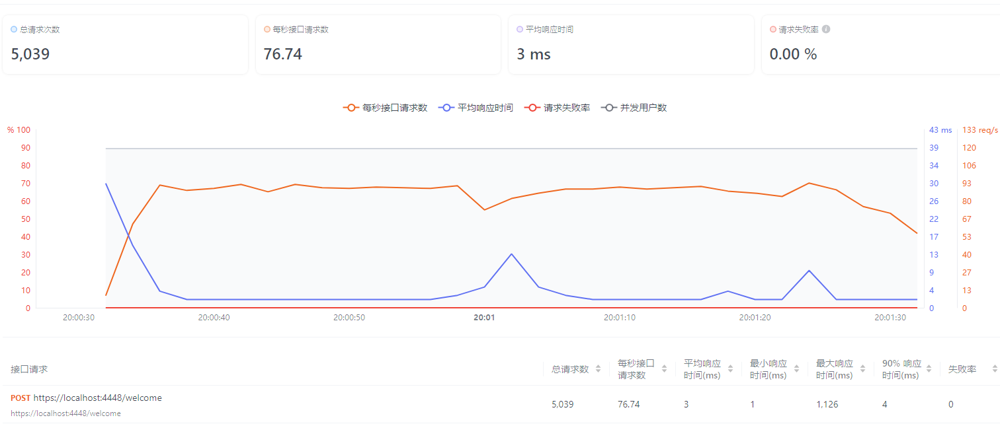
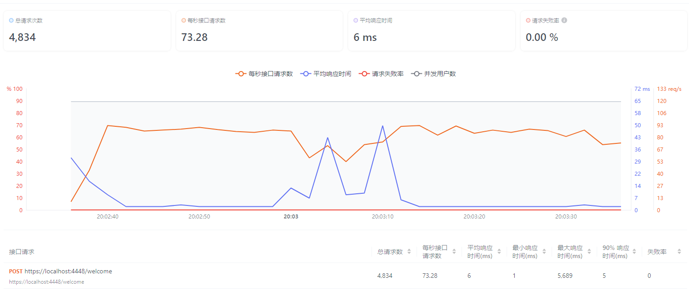

# 测试报告

> 单节点压力测试:(不严谨版)

**QuickFrameWork压力测试**:

```go
//测试代码如下:
func quicTest() {
	//可信的证书
	newServer := server.NewServer("cert.pem", "cert.key", ":4448")
	// 或: newServer := server.NewServer("", "", ":4445")使用自签名证书
	newServer.Route.AddHttpHandler("/welcome", http.MethodPost, func(w http.ResponseWriter, r *http.Request) {
		all, err := io.ReadAll(r.Body)
		if err != nil {
			return
		}
		w.Write(all)
	})
	newServer.StartServer()
}

```



2. **gin压力测试**


```go
//GIN
func GinTest() {
    r := gin.Default()

    // 定义路由和处理函数
    r.POST("/welcome", func(c *gin.Context) {
        all, err := io.ReadAll(c.Request.Body)
        if err != nil {
            return
        }
        c.Stream(func(w io.Writer) bool {
            _, err := w.Write(all)
            if err != nil {
                return false
            }
            return false
        })
    })

    r.RunTLS(":4448", "cert.pem", "cert.key") // 注意：配置TLS后，通常不需要再调用无TLS的r.Run()
}

```


